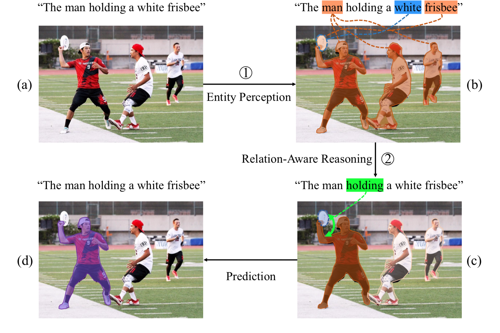

# Referring Image Segmentation via Cross-Modal Progressive Comprehension
Code for Referring Image Segmentation via Cross-Modal Progressive Comprehension, CVPR2020

## Interpretation of our progressive referring segmentation method.

* (a) Input referring expression and image. 

* (b) The model first perceives all the entities described in the expression based on entity words and attribute words, e.g., “man” and “white frisbee”(orange masks and blue outline). 

* (c) After finding out all the candi-date entities that may match with input expression, relational word 087 “holding” can be further exploited to highlight the entity involved with the relationship (green arrow) and suppress the others which are not involved. 

* (d) Benefiting from the relation-aware reasoning process, the referred entity is found as the final prediction (purple mask).


## Setup

We recommended the following dependencies.

* Python 2.7
* Tensorflow 1.5
* Numpy
* Spacy
* pydensecrf

This code is derived from [https://github.com/liruiyu/referseg_rrn](https://github.com/liruiyu/referseg_rrn). Please refer to it for more details of setup.

## Data preparation
* Dataset preprocess

We conduct experiments on 4 benchmarks of referring image segmentation, including `UNC`, `UNC+`, `Gref` and `ReferIt`. After these datasets are downloaded, run following commands for data preparation:
```
python build_batches.py -d Gref -t train
python build_batches.py -d Gref -t val
python build_batches.py -d unc -t train
python build_batches.py -d unc -t val
python build_batches.py -d unc -t testA
python build_batches.py -d unc -t testB
python build_batches.py -d unc+ -t train
python build_batches.py -d unc+ -t val
python build_batches.py -d unc+ -t testA
python build_batches.py -d unc+ -t testB
python build_batches.py -d referit -t trainval
python build_batches.py -d referit -t test
```

* Glove Embedding Obtain

Download `Gref_emb.npy` and `referit_emb.npy` and put them at `data/`. We provide Download Link for Glove Embedding here:
[https://pan.baidu.com/s/19f8CxT3lc_UyjCIIE_74FA](https://pan.baidu.com/s/19f8CxT3lc_UyjCIIE_74FA), pswd: 2m28.


## Training
Train on UNC training set with:
```
python -u trainval_model.py -m train -d unc -t train -n CMPC_model -emb -f ckpts/unc/cmpc_model
```

## Testing
Test on UNC validation set with:
```
python -u trainval_model.py -m test -d unc -t val -n CMPC_model -i 700000 -c -emb -f ckpts/unc/cmpc_model
```
You can also download our checkpoint to test on four benchmarks. We provide checkpoints here:
[https://pan.baidu.com/s/17TJDEiq5xA5ngN2jhsDQYA](https://pan.baidu.com/s/17TJDEiq5xA5ngN2jhsDQYA), pswd: 2miu.


We made a little modify over CMPC_model.py so that the new CMPC_model could achieve higher OverAll IoUs on the four benchmarks.
